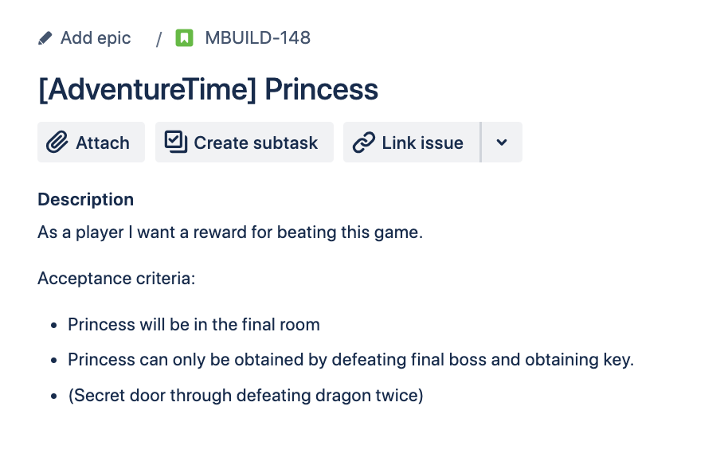
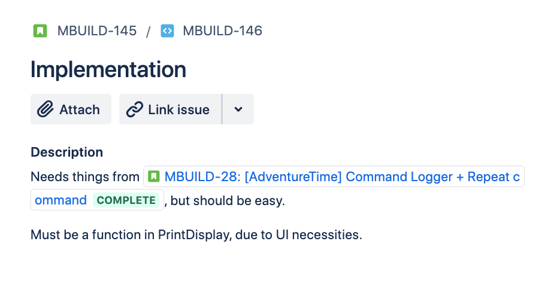
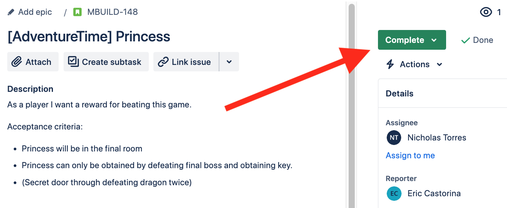
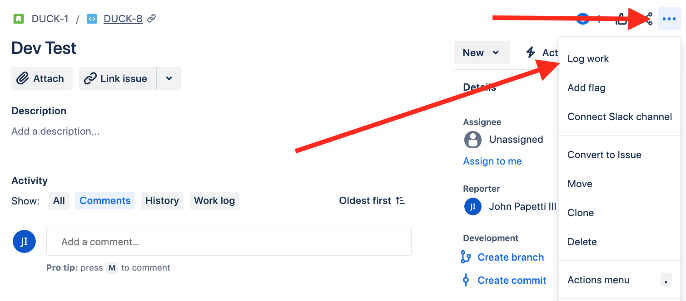
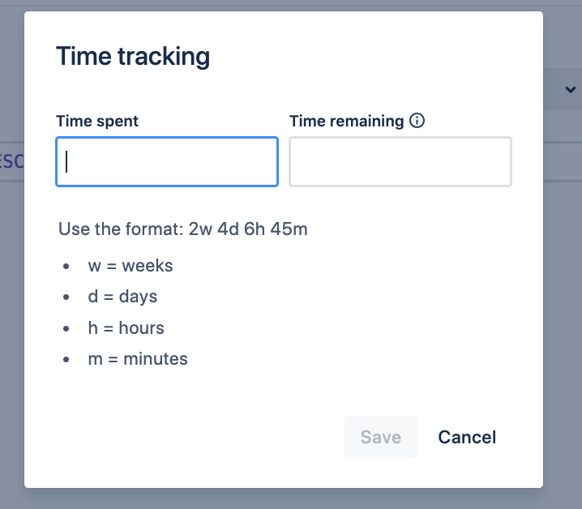

# Intro to Jira
Jira is work management software that allows team members to know what tasks need to be done, who is working on it, how long, etc. 

While mainly used for programming, it can be used for non-programming tasks as well, which includes: 

- Writing the story of the game. 

- Designing art, concepts and animations. 

- Etc. 

## The Lingo

In Jira, there are different ways to classify work being done: 

###   Story
- A group of smaller tasks that define a part.  

- Stories consider the user point of view, not necessarily the developer/designer/etc. 

- There should be a broad overview of what is needed. 

- Acceptance criteria: what determines the story to be complete? 

 Example of a story

###   Subtask /  dev_subtask

- A more specific part of the  Story. 

- These are the fine, program specific details. 

- Dev_subtask is a variant of subtask, which is designed for programming. 

    -  This includes building, review, and completed statuses. 

 Example of a subtask

 Example of dev_subtask

###   Bug

- Does something not work, feel right or doesn’t make sense? If so, use the bug status.  

- In the description, write down everything you know: 

    - What is the issue (explain as much as possible) 

    -  How often does it occur 

    - Steps to reproduce 

    - Logs, reports, etc 

    - Info about your system (like operating system, RAM capacity, etc) 

        - If a web game, note what browser as well. 

    - If an issue is valid, then a subtask can be created referencing the original bug Jira.  

## The Process
Every task, story, and subtask as its own progress report. It’s typically short and to the point, but it can be changed anytime. 

 Changing the status of an story

Some of the descriptions include: 

| Status      | How it works |
| ----------- | ----------- |
| “New (Needs refinement)”      | The story/subtask is not ready to be started yet for one or more reasons. Maybe there is no acceptance criteria, or the plan is not fully written? Whatever the case, try to find a consensus on the issue before moving it to ready.       |
| “Ready”   | There is a plan for the story/subtask and can be worked on! When marked as ready, it can be added to sprint as a task to work on.        |
| “In progress”   | The story/subtask is currently being worked on and is ongoing.           |
| “Code review (unit test)”   | For programmers, this status means that the code is either being tested or is ready to test. Code is considered a draft, until marked as “completed.” Some parts of code review include, checking for syntax errors, making sure tests run correctly and adding comments in code.       |
| “Completed/Resolved”   | The story/subtask is done! No more work needs to be done. If there is a bug or issue with this story, you do not have to mark the story back in progress. Simply make a new story or bug Jira. (You can also link stories by finding the issue id number [example: DUCK-1])         |

Note for code review:

- If a status changes to “completed”, that means code review is finished and looks good! If there are changes that need to be made, it will go back to being marked “in progress”.
- Code reviewing must always have comments with suggestions, improvements, or bug fixes. 

______
In order to see how much development time was put into a story, you’ll need to log time. 
- It will seem like a chore at first, but once started, it will turn into a habit.  

 How to log work

By clicking on “Log work” you get the following prompt:

 Time tracking prompt

Time spent should contain the active time working on a story or task.  

- For example, if a programmer codes for 34 minutes, takes a 20-minute break, then codes for another 10 minutes, the work should be recorded twice, not including the 20-minute break. 

**Rule of thumb: Before you start working on something, write down the time and date of when you started. Right before you finish, go here: https://www.calculator.net/time-duration-calculator.html and find out the duration.** 

Recording the time worked is independent for each story and task. 

- Example: If an artist works on story a for 5 minutes, works on story b for 15 minutes, back to a for 20 minutes, log the work as follows: 

    - Story A: 5m 

    - Story B: 15m 

    - Story A: 20m 

____
###### Revised 3-6-24 